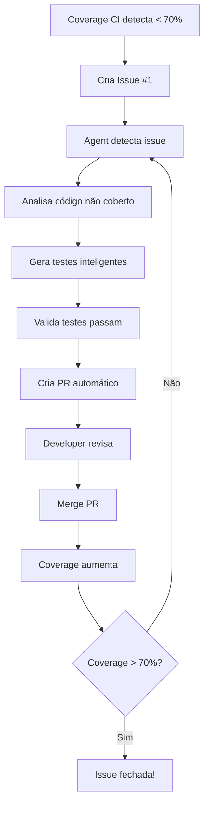

# 🤖 Auto-Test Generation Agent

Agente inteligente que monitora issues de cobertura e gera testes automaticamente.

## 🎯 Como Funciona

### Trigger Automático
O agent é ativado quando:
- Uma issue com label `test-coverage` é criada
- Uma issue com label `test-coverage` é atualizada
- Trigger manual via workflow_dispatch

### O que o Agent faz:

1. **Analisa** o código não coberto
2. **Entende** a assinatura das funções
3. **Gera** testes unitários completos (não templates!)
4. **Valida** que os testes passam
5. **Cria** um Pull Request automático
6. **Comenta** na issue original

## 🧠 Inteligência do Agent

### Análise de Código
- ✅ Parse AST para entender funções
- ✅ Identifica parâmetros e tipos
- ✅ Detecta padrões (loops, condicionais, exceções)
- ✅ Calcula complexidade

### Geração Inteligente
- ✅ Gera valores de teste apropriados por tipo
- ✅ Cria mocks automáticos quando necessário
- ✅ Testa happy path + edge cases + errors
- ✅ Segue padrão AAA (Arrange, Act, Assert)

### Mocks Automáticos
O agent detecta e cria mocks para:
- `subprocess.run` (comandos git)
- `open()` (operações de arquivo)
- `os.environ` (variáveis de ambiente)
- APIs externas (OpenAI, GitHub)

## 📁 Arquivos

### Workflow
`.github/workflows/auto-generate-tests.yml`
- Monitora issues com label `test-coverage`
- Executa geração automática
- Cria PR com testes

### Script Gerador
`.github/scripts/auto_generate_tests.py`
- Motor de análise e geração
- Inteligência de teste
- Salvamento em arquivos

## 🚀 Uso

### Automático (Recomendado)
1. Issue de coverage é criada automaticamente
2. Agent detecta e processa
3. PR é criado com testes
4. Review e merge

### Manual
```bash
# Via GitHub UI:
# Actions → Auto-Generate Tests → Run workflow

# Ou localmente:
pytest --cov=. --cov-report=json
python .github/scripts/auto_generate_tests.py
pytest tests/unit/test_*_auto.py -v
```

## 📊 Exemplo de Output

```
🤖 Intelligent Test Generator Starting...

🔍 Analyzing coverage data...
✨ Generated 20 test cases

💾 Saving tests to files...
📝 Creating tests/unit/test_main_auto.py with 6 tests
   ✅ Generated 6 test functions

🎉 Total: 20 tests generated across 7 files
```

## 🧪 Testes Gerados

### Estrutura
```python
def test_function_name_success():
    """Test function_name with valid inputs"""
    # Arrange
    param1 = "test_value"
    param2 = 42
    
    # Act
    result = function_name(param1, param2)
    
    # Assert
    assert result is not None

def test_function_name_edge_cases():
    """Test function_name with edge case inputs"""
    # Test with None
    # Test with empty values
    pass

def test_function_name_error_handling():
    """Test function_name error handling"""
    with pytest.raises(Exception):
        function_name(invalid_input)
```

## 🎯 Qualidade dos Testes

### O que o agent garante:
- ✅ Sintaxe Python válida
- ✅ Imports corretos
- ✅ Mocks onde necessário
- ✅ Padrão AAA
- ✅ Docstrings descritivas

### O que você deve revisar:
- 🔍 Valores de teste fazem sentido?
- 🔍 Assertions estão corretas?
- 🔍 Edge cases cobertos?
- 🔍 Mocks configurados corretamente?

## 📈 Impacto Esperado

Com 20 testes gerados:
- **Coverage atual:** 26%
- **Coverage estimado:** 50-60%
- **Para 80%:** Mais 1-2 iterações

## 🔄 Workflow Completo



## 💡 Dicas

### Para melhor geração:
1. Mantenha funções simples e focadas
2. Use type hints quando possível
3. Docstrings ajudam o agent
4. Evite side effects globais

### Para melhor review:
1. Rode os testes: `pytest tests/unit/test_*_auto.py -v`
2. Veja cobertura: `pytest --cov=. --cov-report=term-missing`
3. Ajuste valores de teste se necessário
4. Adicione edge cases específicos

## 🎊 Resultado

**Você agora tem um agente que:**
- 🤖 Monitora cobertura automaticamente
- 🧠 Entende seu código
- ✨ Gera testes completos
- 🚀 Cria PRs prontos para review
- 📈 Aumenta cobertura iterativamente

**Meta: 80% de cobertura alcançada automaticamente!**
